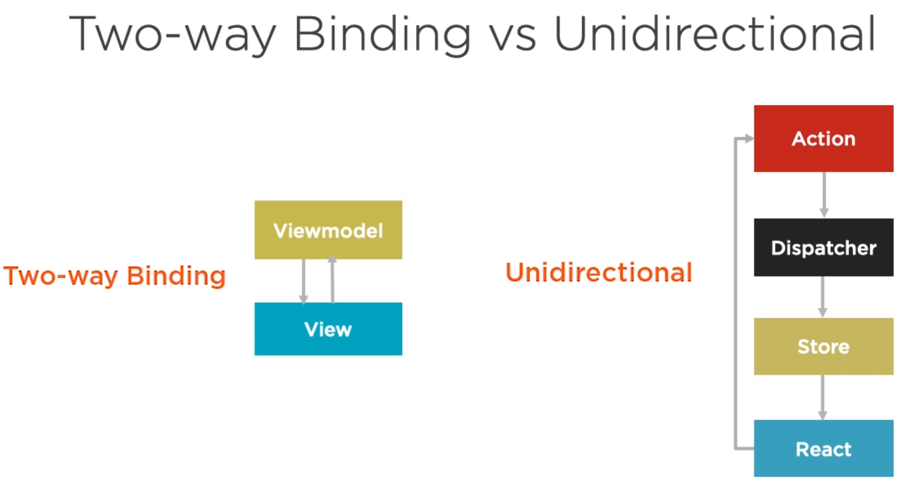
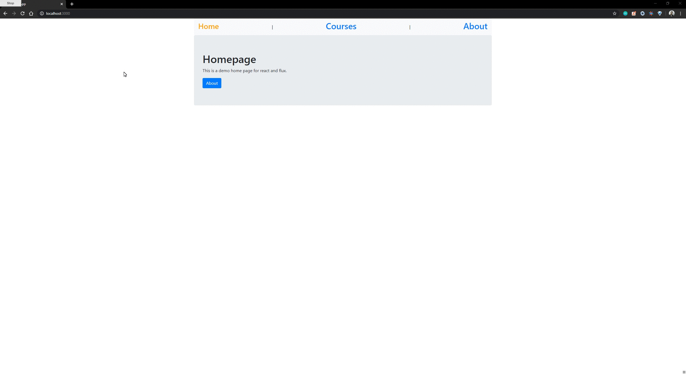
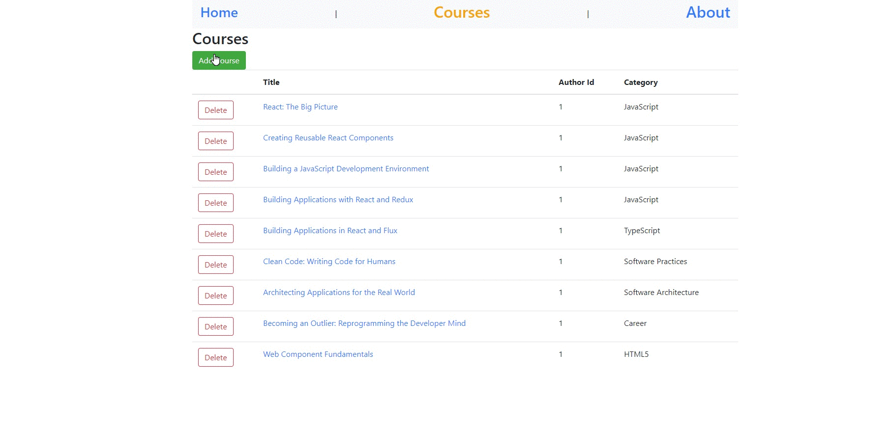
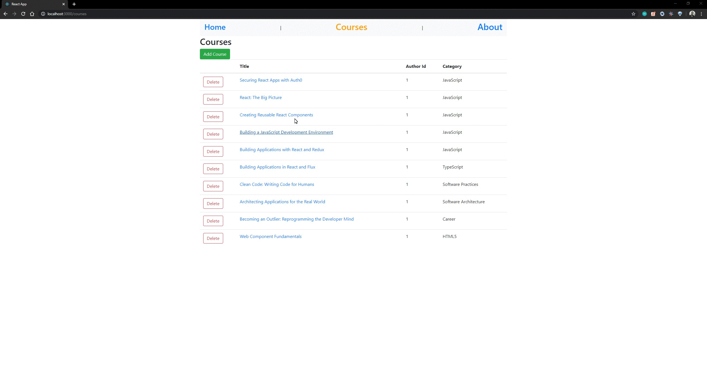

## Building Applications with React and Flux demo

This repo is an implementation for the capston project of pluralsight online course: https://app.pluralsight.com/library/courses/react-flux-building-applications/, which is hosted by @housecor. I recommend you to finish this course before diving into the pattern, docs, or code of Flux. This course is very short but it can give you an overview of What Flux pattern is, why we need Flux, and how to compose it with React.

The original course was in JavaScript. I implemented it with TypeScript, and I also made a version which uses pure React in `./full-feature-without-flux`. You can have a comparation between the 2 versions.

Actually, the process of refactoring the project from pure React to Flux, is the process of modifying every place that you touch the state. For this demo, it is to replace all api call with actions call.

---

---

To run this app, just type `npm start` after your installed the relevant packages.

The mock API will be in http://localhost:3001/..., the app will run in http://localhost:3000/

---

**Demo recording**

- router
  

- data
  
  
